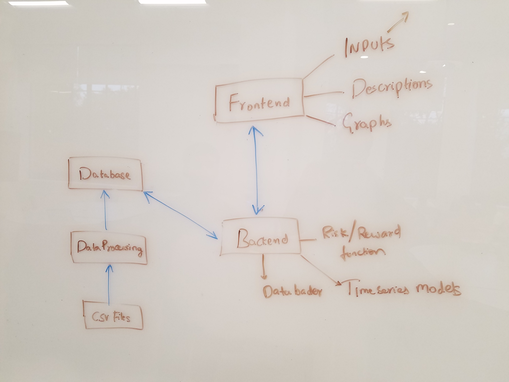

# Use Cases

This is a brief overview of how a user will interact with the tool and how this ties in to the various components defined above:

### Deciding on a risk measure
This is where the users interact with the first frontend component "Risk measure selection". A list of different risk measure models with a brief description of each will be available to users, who can then select one of these.

### Selecting a list of portfolio (asset allocation models) for the chosen risk measure
Users interact with the second frontend component "Asset allocation model selection" where from a list of different portfolios, they can select which ones they wish to compare.

### Selecting a time period to view returns and risk
Here the users interact with the third frontend component where they select the time period (in years) over which they wish to see returns vs. risk for the preselected combinations of risk measure and portfolios.

### Seeing how choice of risk measure affects asset allocation decisions
In the background, the user inputs will interact with all the backend components, returning a list of values to the frontend graph component which presents a plot of risk vs. reward to the user.

### Seeing how well past risk and returns predict future risk and returns
The user interacts with the third front-end component where they graph the relationship between risk and return, but restrict the data source to a certain time period in the past. This allows them to compare (for example) the results if they had run the same query 20 years ago to the results today, and gives a sense of how uncertain the risk and reward levels shwon by our tool are.

# Overview

# COMPONENTS
## Database containing data of stock, bonds, inflation and other market data sources.
## Frontend components:
   Short descriptions of what each risk measure does
   List of portfolios to display on the graph
   ### Input components:
        - Risk measure selection dropdown menu
        - Check boxes to allow selection of multiple portfolios
        - Time period selection (possibly as a slider on graph)
   ### Graphs
        - Plot of risk vs reward.
## Backend components:
   ### Data processing and setup:
     - Description:
       - Populates the DB with data from multiple CSV files.
       - Pre-processing and cleaning the raw data.
     - Inputs:
       - CSV files
     - Outpus:
       - None
   ### Data loader:
     - Description:
       - Opens a connection to the database.
       - Constructs a query to fetch the required data.
     - Inputs: Fields to fetch from the data (time period, stock/bond name, etc.)
     - Outputs: Rows from the DB
   ### A function to calculate Risk/Reward values:
     - Description:
        - Call the data loader component.
        - Calculates the output.
     - Inputs: the user selection from the frontend
     - Outputs: List of data points to be plotted.
   ### Probabilistic model of future performance based on past:
     - Description:
        - Calculates output of risk/reward value function as if it had been run at many different times in the past.
     - Inputs: user selection from the front end
     - Outputs: a measure of how robust the risk/reward measures are over different time periods
